# sentinel-memory

> A unified memory layer for an AI security analyst agent. One substrate. Nine
> patterns. Zero lock-in. Built on Postgres 16 + pgvector — nothing else.

Implementation of the six core patterns from **"Architectures for Agentic AI
Data" (Stewart & Huang, O'Reilly 2025)** on a single open-source engine:

- **RAG** over a remediation playbook corpus
- **Semantic-transactional join** — vector similarity + SQL filters in one atomic query
- **Episodic memory** — the agent remembers previous turns of a session
- **LTM** — analyst preferences applied automatically as SQL filters
- **Temporal consistency** — forensic `AS OF TIMESTAMP` via SCD2
- **Native CDC** — embeddings kept fresh via `LISTEN/NOTIFY` (no Kafka)
- **Immutable audit log** — protected by DB-level triggers
- **RBAC** — the role lives in LTM, enforced on every handler
- **Living index** — human feedback re-weights retrieval without re-training the model

Plus a **minimalist analyst console** that exposes every pattern through a
zero-dependency dark-mode UI served by the same FastAPI service.

---

## Why this project

The reference book makes a compelling case for **TiDB** as the unified
substrate for agentic memory. The architectural thesis — *one engine for
facts and vectors, ACID across both* — is sound. The remaining question is
which engine best serves *this* scope (portfolio, local-first, fewer than
1M vectors).

I evaluated five alternatives and documented the decision in
[`docs/adr/001-postgres-pgvector-vs-tidb.md`](docs/adr/001-postgres-pgvector-vs-tidb.md).
**Postgres 16 + pgvector** won on local-first ergonomics, zero cloud account
required, 25+ years of operational maturity, and a clean migration path to
distributed engines if the corpus ever outgrows a single node.

> The thesis is the value. The engine is a project-scope decision.

---

## Architecture



Three services in Docker Compose, one private network:

- **Memory API** (FastAPI) — exposes retrieval, chat, feedback, audit, and serves the UI
- **Embedding worker** — consumes `LISTEN/NOTIFY` and keeps vectors fresh
- **Memory layer** (Postgres 16 + pgvector) — 5 tables + 4 triggers + 1 view

The API and the worker share **the same Docker image** — they are both
legitimate consumers of the same capability (embed + write to memory).
Only the command differs.

---

## Prerequisites

- **Docker** and **Docker Compose** v2.
- **Your own Anthropic API key.** The `/chat` endpoint calls Claude on
  *your* account, so you need to generate a personal key at
  [console.anthropic.com](https://console.anthropic.com/) → *Settings → API
  Keys*. The free tier is enough to run the whole demo (the entire DEMO.md
  flow consumes well under $0.05 with Haiku 4.5). The key is never
  transmitted anywhere except to `api.anthropic.com` from your own machine.

> Heads up: the project ships only with `.env.example`. The real `.env`
> is gitignored on purpose so no one's key — mine or yours — ever ends
> up in the repo. If you fork this and start hacking on it, do the same:
> keep your `.env` local.

## Quick start

```bash
git clone https://github.com/CristianCaro-portfolio/sentinel-memory.git
cd sentinel-memory
cp .env.example .env
# now open .env and replace the two placeholders:
#   POSTGRES_PASSWORD   -> any string you like
#   ANTHROPIC_API_KEY   -> sk-ant-... (from console.anthropic.com)
docker compose up -d --build

# embed the seed data (one-shot)
docker compose exec api python scripts/embed_seed.py

# open the analyst console
open http://localhost:8000/ui/
```

Without a valid `ANTHROPIC_API_KEY`, every endpoint except `/chat` still
works — retrieval, semantic-transactional join, alerts, audit and
preferences are all self-contained on Postgres. Chat is the only flow
that calls out to Claude.

Other entry points:

| URL | What |
| --- | --- |
| http://localhost:8000/ui/   | Analyst console (chat, search, alerts, audit, prefs) |
| http://localhost:8000/docs  | Auto-generated OpenAPI playground |
| http://localhost:8000/health | Liveness check |

Five-minute guided demo: [`DEMO.md`](DEMO.md).

---

## The analyst console

A single-file dark UI served at `/ui/` by the same FastAPI process. No
build step, no npm, no framework — vanilla HTML / CSS / JS, ~750 LOC total.

Five tabs:

- **chat** — multi-turn conversation with the agent. Each assistant turn shows its
  citations (playbook chunks + similar alerts) with thumb-up / thumb-down
  buttons that write to the `feedback` table on the spot.
- **search** — side-by-side retrieval over the playbook corpus and the alerts
  catalogue, with severity-pill filters that exercise the
  semantic-transactional join.
- **alerts** — list view with per-alert SCD2 timeline. Lets you create alerts
  (the worker picks them up via CDC and embeds them in seconds).
- **audit log** — live tail of every retrieval and write recorded by the
  governance helper.
- **preferences** — read and upsert LTM rows. Changing `severity_filter` here
  immediately affects how retrieval ranks alerts — no redeploy.

The identity in the top-right (`X-Analyst-Id`) lets you switch personas:
type `cristian` to act as a `senior_analyst`, `audit_bot` to see the RBAC
denials, or any other id to test fall-through behaviour.

---

## The query that justifies the project

```sql
SELECT alert_id, severity, raw_text,
       embedding <=> $1::vector              AS distance,        -- semantic ranking
       COALESCE(fs.avg_rating, 0)::real      AS feedback_score,  -- living index
       (embedding <=> $1::vector)
         - (COALESCE(fs.avg_rating, 0) * 0.2) AS final_score
FROM alerts a
LEFT JOIN feedback_scores fs
  ON fs.target_kind = 'alert' AND fs.target_id = a.alert_id
WHERE embedding IS NOT NULL
  AND severity = ANY($2::text[])             -- LTM-driven filter
  AND detected_at >= $3                      -- temporal filter
ORDER BY final_score
LIMIT $4;
```

One atomic query combines: vector similarity, transactional filters
(injected from LTM), the team's accumulated feedback, and the final
ranking. In a split stack (Postgres + Pinecone), the same pattern requires
2–3 round-trips and client-side re-ordering. Here, **one execution plan**.

---

## Layout

```
sentinel-memory/
├── docs/
│   ├── adr/                        # architectural decisions
│   └── architecture/               # C4 diagrams
├── db-init/                        # SQL run on first up
│   ├── 01_extensions.sql
│   ├── 02_schema.sql               # the 5 tables
│   ├── 03_seed.sql
│   ├── 04_temporal_and_cdc.sql     # SCD2 + LISTEN/NOTIFY
│   └── 05_governance.sql           # feedback + RBAC seed
├── app/
│   ├── memory/                     # retrieval, episodic, ltm, db
│   ├── llm/                        # Anthropic wrapper
│   ├── governance/                 # audit, RBAC
│   └── main.py                     # FastAPI + UI mount
├── workers/
│   └── embedding_worker.py         # CDC consumer (LISTEN/NOTIFY)
├── web/                            # analyst console (vanilla JS)
│   ├── index.html
│   ├── styles.css
│   └── app.js
├── scripts/
│   └── embed_seed.py
├── docker-compose.yml
├── DEMO.md
└── README.md
```

---

## Stack

| Layer | Technology | Why |
| --- | --- | --- |
| Storage + vectors | Postgres 16 + pgvector | One engine for SQL, vectors, audit, history |
| API | FastAPI + uvicorn | Type hints + auto-generated OpenAPI |
| LLM | Anthropic Claude Haiku 4.5 | $1/$5 per 1M tok, plenty of quality for the use case |
| Embeddings | sentence-transformers/all-MiniLM-L6-v2 | 384 dims, CPU-only, ~80MB |
| UI | Vanilla HTML + CSS + ES modules | Zero build step, served by the same FastAPI |
| Orchestration | Docker Compose | Portable, single-command boot |

---

## Patterns by book chapter

| Chapter | Pattern | Table / file |
| --- | --- | --- |
| Ch 1 | Episodic + LTM | `episodic_memory`, `ltm` |
| Ch 2 | Memory as infrastructure | the whole layer |
| Ch 3 | RAG | `playbook_chunks` + `/search/playbooks` |
| Ch 3 | Semantic-transactional join | `alerts` + `/search/similar-incidents` |
| Ch 3 | Temporal consistency | `alerts_history` + `/alerts/{id}/as-of` |
| Ch 3 | CDC | `LISTEN/NOTIFY` + `workers/embedding_worker.py` |
| Ch 4 | Embedded governance | `audit_log` + immutability triggers |
| Ch 4 | Living index | `feedback` + `feedback_scores` view |
| Ch 4 | RBAC / isolation | `app/governance/rbac.py` |

---

## Roadmap

- [x] Foundation: pgvector, schema, seed
- [x] RAG + semantic-transactional join
- [x] Episodic memory + LTM + multi-turn chat
- [x] Temporal consistency + CDC
- [x] Governance: audit + RBAC + living index
- [x] Analyst console UI
- [ ] dbt over `audit_log` and `feedback` for operational marts
- [ ] Real Kafka (replaces simulated CDC)
- [ ] Terraform + deploy to Cloud Run + Neon

---

## License

MIT.
